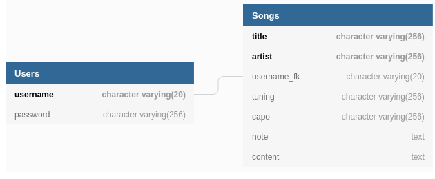

# Scelte implementative
Per lo sviluppo dell'API web è stato usato il framework [Express](https://expressjs.com/ "Express") per [NodeJS](https://nodejs.org/ "NodeJS").

## Architettura del progetto
Come client è stato implementato un sito web, le varie pagine web si trovano nell'apposita cartella *views* e sono gestite dallo stesso server che gestisce l'API.

> Per differenziare i percorsi riservati all'API da quelli riservati al sito, si è scelto il prefisso */api/* per i servizi dedicati all'API.

## Formato dati
Per una semplicità di implementazione è stato costruito un *Header Custom* con i campi per le credenziali di accesso.
La scelta è stata fatta sulla base del servizio di *continuous delivery* offerto da Heroku che dispone di HTTPS.

> Il preciso formato dei dati di input ed output sono descritti nel file [openapi.yaml](../openapi.yaml "openapi.yaml").

## Database
Per il salvataggio dei dati è stato implementato un DBMS [PostgreSQL](https://www.postgresql.org/ "PostgreSQL") offerto anch'esso da Heroku.

  

